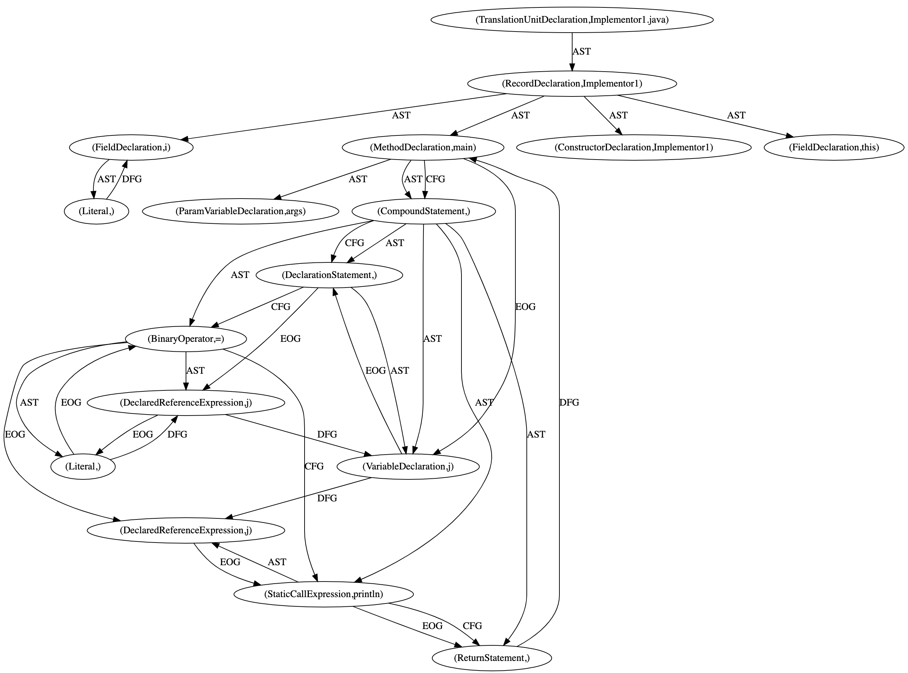

# Code Property Graph to Dot

[](https://api.reuse.software/info/github.com/SAP-samples/security-research-taintgraphs)


This tool reads Java and C++ code, exports its
- Control Flow Graph
- Data Flow Graph
- Abstract Syntax tree


## Build

Build using Gradle

```
git clone https://github.com/SAP-samples/security-research-taintgraphs cpg-to-dot
./gradlew installDist
```

## Recommended Database

We find that Memgraph has the most efficient performance. Comparing Neo4J and Memgraph
```
docker pull memgraph/memgraph-platform
docker image tag memgraph/memgraph-platform memgraph
docker run --memory="15g" -it -p 7687:7687 -p 3000:3000 -e MEMGRAPH="--query-execution-timeout-sec=180000 --bolt-session-inactivity-timeout=1800000 --query-max-plans=100000 --log-level DEBUG --memory-limit=15000 --storage-wal-enabled=false --storage-snapshot-interval-sec=0" memgraph
```

## Modes

### Pathsextraction
Export paths between user-controlled sources and sinks with intersections between Gitdiff changes:

This mode needs a running cypherql capable database up and running, e.g.:
```
╰─ build/install/cpg-to-dot/bin/cpg-to-dot --gitFile data/libxml2_git.txt --host localhost --port 7687 --protocol bolt --output out
```
The above command will use a graph database accessible via Bolt. 

The extracted paths will be written to %out% directory with the pattern %out%/%commit%.cpg

The git text file should have following format:
```
http://GITREPO/URL
FIRST INISTAL COMMIT
Commit that fixed vulnerability #1
Commit that fixed vulnerability #2
...
Commit that fixed vulnerability #n
```

### Load CPG to DB
This mode will load a path to a project into a graph database.
```
╰─ build/install/cpg-to-dot/bin/cpg-to-dot --file path/to/project --host localhost --port 7687 --protocol redis
```

### Simply export a CPG as Dot
```
╰─ build/install/cpg-to-dot/bin/cpg-to-dot --file path/to/project --output out
```

## Example output
(Old image)
```Java
public class Implementor1  {

    private final static int i = 6;

    public static void main( String... args ) {
        final int j;
        j = 14;
        System.out.println(j);
    }
}
```




## Requirements

The application requires Java 11 or higher.

## Optional commands

```
--tmpPath <Path to a temporary folder used for Git>
```

### Uses

Thanks to Fraunhofer AISEC for:
- https://github.com/Fraunhofer-AISEC/cpg-vis-neo4j
- https://github.com/Fraunhofer-AISEC/cpg
